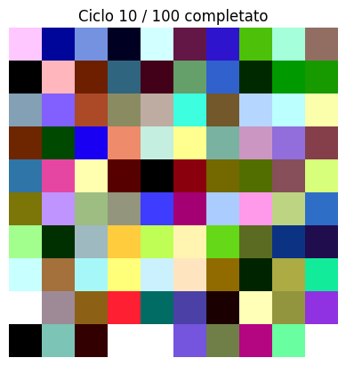

# Adversarial Patch Project 

Useful project to discover various adversarial patch creation techniques for neural networks , which can missclassify and cheat object detectors and object classifiers. Multiple networks , multiple techniques , will be analyzed and details and conclusions will be evaluated for each one.

# Static Patch

Static patch technique was used with Gradient-Based Optimization , that is, it consists of calculating the gradients of the loss function with respect to the opposing patch and updating the patch to maximize the probability that the model misclassifies the target image. 
Because I wanted the patches to be printable, they were composed of generally 10*10 grids

## Creation of the patches
After few iteration the patch change according to gradient of the choosed class , in this case the '0' class

