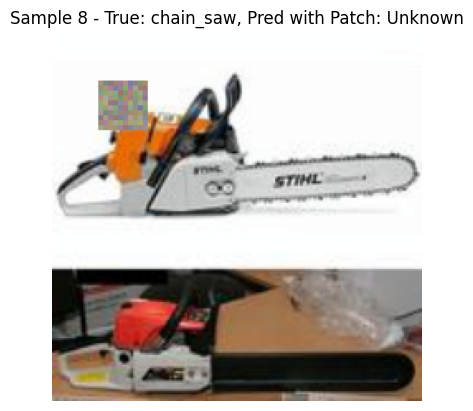
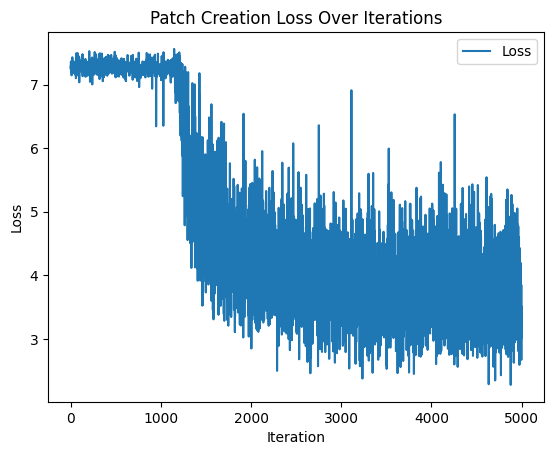

# Adversarial Patch Project 

Useful project to discover various adversarial patch creation techniques for neural networks , which can missclassify and cheat object detectors and object classifiers. Multiple networks , multiple techniques , will be analyzed and details and conclusions will be evaluated for each one.

# Static Patch

Static patch technique was used with Gradient-Based Optimization , that is, it consists of calculating the gradients of the loss function with respect to the opposing patch and updating the patch to maximize the probability that the model misclassifies the target image. 
Because I wanted the patches to be printable, they were composed of generally 10*10 grids

## Creation of the patches
After few iteration the patch change according to gradient of the choosed class , in this case the '0' class. As we can see the color of the cells changes with the number of iterations , going to highlight a refinement of the patch. At the creation stage, the patch is inserted randomly within the image.

Example of patch : 

## Example of Classified object

**The accuracy of the oriignal model was 73.5% ,  instead with the patched image the accuracy is decreased around 6.18% , deterioration caused by static patches is evident**

### Correct-Classified object
Example of classified images from the Resnet50 network , without applying any patches , as you can see , the images are classified correctly.

**Grad-CAM Analysis**
As can be seen from the images below , related to the heat map provided by Grad-CAM , the network without the patches correctly identifies the pixel zones most relevant to the correct class classification. The blue zones are the least important , the red zones are the most important.

### Miss-Classified object
These images show an example of the resnet50 model that missclassifies images due to a patch 15% the size of the image , and with a 10*10 grid. The patch is insered randomly within the image to ensure that the patch does not go to cover the main subject of the image , unintentionally causing missclassification.

**Grad-CAM Analysis**
Instead in this second example you can see , how the heat maps turn out to be completely out of whack , in fact the red zones (zones that weigh most to the classification) are completely wrong , regardless of where the patch is placed. This means that the gradient detected by the network has been perturbed , leading to a miss-classification.

## How work the Patch Update

1. We pass a batch of images through the model with the patch applied, calculate the loss between the model output and the desired target class.
2. By performing loss.backward(), we calculate the gradient of the loss with respect to each pixel. This gradient indicates the “direction” in which the value of each pixel must change to reduce the loss and move closer to the target for each channel 
3. The average gradient for each channel in the cell (y, x) is then calculated, resulting in a single value for each channel (R, G, B) that is then applied to all pixels in the cell (This keeps the color uniform within the cell)
The gradient is a three-component vector (one for each channel) that represents the direction and magnitude of change needed. For example, a positive gradient value for a color channel indicates that increasing the intensity of that channel (i.e., making that channel “brighter”) would reduce loss, while a negative value indicates that we should decrease it.
This means that the value of each channel (red, green, blue) is increased or decreased according to the sign of the gradient and its magnitude, controlling the intensity of each color.

Note : 

During the training of the patch , is decreased the loss as is possible to see in the plot. This mean that the patch is more efficent than the beginning of the training , the optimal patch should have loss equal to zero.

## What I expected :
- From the results I expected the network to misclassify by identifying each image with the target class equal to 5 (French_horn) , but this did not happen , in fact it randomly misclassifies. This could be due to the few cycles the patch had for specialization. An attempt will be made to increase the number of cycles for the update.
- It was also expected that the heat maps of any image with the patch would be similar to the heat map of an image with the same target class, thus French_horn. 

